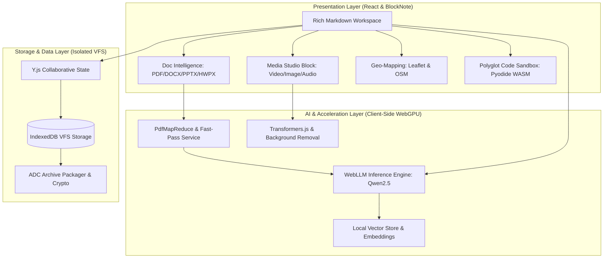

# 🌟 AMEVA Workstation: Next-Gen AI-Powered Integrated Media Workspace

<div align="center">

[](https://ameva-workstation-web-core.vercel.app/)
[](https://github.com/uno-km/AMEVA-Workstation-Web/stargazers)


<br/>

### 🔗 **[👉 브라우저에서 즉시 체험하기 (Live Web Demo)](https://ameva-workstation-web-core.vercel.app/)**

**오프라인 100% 프라이버시가 보장되는 온디바이스 WebGPU 로컬 AI 에이전트와 통합 멀티미디어(동영상·이미지·오디오) 저작 스튜디오, 인터랙티브 지능형 문서화 시스템**

[🌐 라이브 데모](https://ameva-workstation-web-core.vercel.app/) • [✨ 주요 기능](#-핵심-기능-상세-매뉴얼-user-manual) • [🎬 미디어 스튜디오](#1-멀티미디어-인앱-저작-스튜디오-video--image--audio) • [📑 문서 AI 요약](#2-온디바이스-webgpu-문서-인텔리전스--다단계-요약-덱) • [🌐 번역 & 문체 다듬기](#3-지능형-번역--문체말투-다듬기-시스템) • [🤖 챗봇 & 에이전트](#4-차세대-ai-어시스턴트--자율-에이전트-패널) • [🗺️ 지능형 지도](#5-인터랙티브-지도-문서화--경로-탐색-시스템) • [🚀 시작하기](#-빠른-시작-가이드)

</div>

---

## 📖 프로젝트 개요 (Overview)

**AMEVA Workstation**은 기존의 정적 마크다운 에디터와 파편화된 외부 툴(동영상 자르기, 이미지 편집기, 오디오 무음 제거기, PDF 뷰어, 지도 캡처, 외부 번역기 등)을 **단 하나의 통합 데스크톱 웹 워크스테이션**으로 집대성한 차세대 저작 환경입니다.

외부 클라우드나 API 키 없이도 사용자의 PC 그래픽카드(WebGPU)를 활용하여 **초고속 온디바이스 로컬 AI 추론(Qwen2.5, Whisper, Transformers.js)**을 구동하며, 문서 내에서 직접 비디오 컷편집, 이미지 배경 제거(AI Remove BG), 오디오 무음 자동 삭제, 대용량 PDF/Word/PPT 맵리듀스 요약, 다국어 번역, 인터랙티브 지도 동기화를 완벽하게 수행합니다.

---

## 🧭 핵심 기능 상세 매뉴얼 (User Manual)

```
┌──────────────────────────────────────────────────────────────────────────────────┐
│                             AMEVA Workstation System                             │
├───────────────────┬───────────────────┬───────────────────┬──────────────────────┤
│ 🎬 Media Studio   │ 📑 Doc AI Summary │ 🌐 Translation    │ 🗺️ Geo-Mapping       │
│ • Video Cut & Trim│ • PDF/DOCX/PPTX   │ • On-Device Neural│ • OpenStreetMap & Pin│
│ • Image Canvas/BG │ • Fast-Pass (3s)  │ • Tone Polishing  │ • Route Search (OSRM)│
│ • Audio Silence X │ • Chapter Summary │ • 0-Data Leakage  │ • Markdown VFS Sync  │
└───────────────────┴───────────────────┴───────────────────┴──────────────────────┘
```

---

### 1. 🎬 멀티미디어 인앱 저작 스튜디오 (Video / Image / Audio)

문서 내에 삽입된 모든 미디어는 외부 프로그램을 열 필요 없이 에디터 내부에서 즉시 가공하고 결과를 반영할 수 있습니다.

#### 🎥 동영상 컷편집 & 8방향 리사이저 (`/video`)
* **타임라인 정밀 컷편집**: 영상 블록 우측 상단의 `[✂️ 편집 모드]`를 누르면 하단에 타임라인 컨트롤러가 활성화됩니다.
  * 좌/우 슬라이더 핸들을 드래그하여 원하는 시작 시간(`Start`)과 종료 시간(`End`)을 초 단위로 정밀 지정합니다.
  * `[적용]` 버튼을 누르면 원본 영상 손상 없이 선택한 구간만 반복 재생 및 문서에 저장됩니다.
* **상하좌우 자유 리사이징**: 편집 모드 및 기본 뷰 모드에서 동영상이 찌그러지지 않고 화면 비율을 유지하며, 8방향 리사이즈 핸들로 자유롭게 크기를 조절할 수 있습니다.
* **클린 미리보기 모드**: 문서 미리보기(Preview) 모드에서는 편집 UI와 툴바가 자동으로 숨겨지고 깔끔한 비디오 플레이어만 노출됩니다.

#### 🖼️ 이미지 갤러리 & Fabric.js 캔버스 스튜디오 (`/image`)
* **다중 사진 갤러리**: 여러 장의 사진을 한 번에 업로드하여 **격자형(Grid)** 또는 **가로 스크롤 캐러셀(Carousel)** 형태로 감상할 수 있습니다.
* **개별 사진 8방향 크기조절 (`ResizableImageCard`)**: 사진마다 우측/하단/우하단 리사이즈 핸들을 잡고 드래그하면 실시간 해상도(`Width × Height`) 툴팁과 함께 개별 크기를 자유롭게 변경할 수 있으며, 크기 설정은 마크다운에 영구 저장됩니다.
* **인앱 캔버스 편집기**: 사진 위 가위(`✂️`) 버튼을 누르면 Fabric.js 기반의 드로잉, 텍스트 삽입, 크롭, 회전, 명도/대비 필터 편집기가 열립니다.
* **AI 1-클릭 배경 제거 (Remove BG)**: 인물/사물 사진의 배경을 인공지능이 1초 만에 깔끔한 투명 배경(PNG)으로 분리합니다.
* **상단 스마트 라이트박스**: 사진을 더블클릭하면 화면 중앙 상단에 배치된 확대/축소/회전 툴바로 방해 없이 원본 고화질을 감상할 수 있습니다.

#### 🎙️ 오디오 파형 스튜디오 & 무음존 자동 삭제 (`/audio`)
* **인터랙티브 파형(Waveform) 시각화**: 오디오 파일 삽입 시 실시간 주파수 진폭 파형이 생성됩니다.
* **⚡ 무음존 자동 감지 및 1-클릭 삭제 (Silence Detection & Removal)**:
  * 회의 녹음이나 강의 음성에서 말이 없는 불필요한 공백/무음 구간을 파형 분석 알고리즘이 자동으로 식별합니다.
  * `[⚡ 무음존 일괄 삭제]` 버튼 한 번으로 무음 구간을 통째로 잘라내어 재생 시간을 획기적으로 압축합니다.
* **구간 컷팅 & 재생 배속 제어**: 0.5x ~ 2.0x 배속 재생 및 원하는 구간만 루프 재생을 지원합니다.

---

### 2. 📑 온디바이스 WebGPU 문서 인텔리전스 & 다단계 요약 덱

대용량 논문, 보고서, 프레젠테이션 파일을 업로드하면 WebGPU AI가 로컬에서 고속으로 구조를 분석하고 단계별 요약을 생성합니다.

```
[문서 업로드 (PDF / Word / PPTX / HWPX)]
       │
       ▼
 ┌───────────────┐  1~3페이지 (소형)   ┌────────────────────────────────┐
 │ 문서 크기 판별 │ ─────────────────▶ │ ⚡ 3초 Fast-Pass 직접 요약       │
 └───────┬───────┘                    └────────────────────────────────┘
         │ 4페이지 이상 (대형)
         ▼
 ┌─────────────────────────────────────────────────────────────────────┐
 │ 3단계 맵리듀스 (Chunking ➔ Clustered Summary ➔ Comprehensive Deck) │
 └──────────────────────────────────┬──────────────────────────────────┘
                                    ▼
       ┌────────────────────────────────────────────────────────┐
       │ 🗂️ 다단계 챕터별 카드 요약 덱 (Document Summaries Deck) │
       │ [핵심 요약] | [챕터 1: 서론] | [챕터 2: 본론] | [결론]  │
       └────────────────────────────────────────────────────────┘
```

* **지원 포맷**: **PDF**(`.pdf`), **MS Word**(`.docx`), **MS PowerPoint**(`.pptx`), **한글**(`.hwpx`) 완벽 지원.
* **⚡ 3초 Fast-Pass 고속 요약**: 1~3페이지 내외의 소형 문서는 불필요한 다단계 맵리듀스를 생략하고 단일 패스로 3~4초 만에 즉시 요약 리포트를 뽑아냅니다.
* **대용량 다단계 맵리듀스(Map-Reduce)**: 수십~수백 페이지 문서의 경우 챕터/섹션별로 클러스터링하여 각 단계별 요약 카드로 구성된 **요약 덱(Deck)**을 제공합니다.
* **에디터 본문 1-클릭 삽입**: 생성된 요약 카드는 버튼 클릭 한 번으로 현재 마크다운 본문의 원하는 위치에 블록 형태로 바로 삽입할 수 있습니다.
* **하단 상태바 실시간 인디케이터**: 문서 분석 진행률과 백그라운드 큐 상태가 하단 상태바(`StatusBar`)에 실시간으로 표시됩니다.

---

### 3. 🌐 지능형 번역 & 문체(말투) 다듬기 시스템

에디터에서 작성 중인 글을 블록 지정하면 나타나는 AI 컨텍스트 메뉴를 통해 1초 만에 문장을 변환합니다.

* **온디바이스 신경망 번역 (Neural Translation)**:
  * **지원 언어**: 한국어 ⇄ 영어, 일본어, 중국어, 스페인어, 프랑스어, 독일어 등
  * 외부 번역 API를 거치지 않고 내 PC의 WebGPU로 번역하여 기업 기밀 및 개인정보 유출을 100% 방지합니다.
* **4대 맞춤형 문체/말투 다듬기**:
  * 🎓 **학술/논문체**: 정형화된 학술 용어와 객관적인 피동/논증형 어조로 변환.
  * 💼 **비즈니스 격식체**: 이메일, 제안서, 결재 보고서에 최적화된 정중하고 명확한 비즈니스 톤으로 수정.
  * ☕ **친근한 캐주얼체**: 블로그, 사내 위키, 노션 스타일에 어울리는 읽기 편하고 매끄러운 어투로 변환.
  * 💻 **개발자/기술 문서체**: 간결하고 군더더기 없는 테크니컬 라이팅 및 릴리즈 노트 스타일로 정리.
* **실시간 AI Diff 비교**: 원본 텍스트와 변환된 텍스트의 변경점을 시각적인 인라인 Diff 뷰어로 대조 확인 후 적용할 수 있습니다.

---

### 4. 🤖 차세대 AI 어시스턴트 & 자율 에이전트 패널

화면 우측의 지능형 AI 패널(`Cmd/Ctrl + L` 또는 우측 상단 로봇 아이콘)을 통해 문서 저작과 코드 개발을 보조받을 수 있습니다.

* **WebLLM WebGPU 가속 엔진**: Qwen2.5-0.5B, 1.5B, 7B 등 고성능 오픈소스 LLM 모델을 선택하여 브라우저 로컬 캐시에서 가속 실행.
* **로컬 RAG (Retrieval-Augmented Generation)**: 현재 열린 문서와 첨부 파일의 내용을 실시간 벡터화하여 질문에 대해 정확한 본문 근거를 기반으로 답변.
* **에디터 툴 자율 실행 (Tool Calling)**: "이 문단 아래에 3행 3열 표를 만들어줘", "방금 작성한 코드의 버그를 고쳐줘"와 같은 명령을 내리면 AI가 에디터 블록을 직접 수정합니다.
* **다국어 코드 자동 생성 & 디버깅**: Python, JavaScript, SQL, HTML뿐만 아니라 Mermaid 다이어그램 코드까지 문법 오류 없이 생성 및 1-클릭 패치.

---

### 5. 🗺️ 인터랙티브 지도 문서화 & 경로 탐색 시스템 (`/map`)

보고서나 여행 계획서, 답사 일지, 물류 동선 문서화에 최적화된 인터랙티브 지도 블록을 제공합니다.

* **장소 및 주소 실시간 검색**: OpenStreetMap 지오코딩 엔진을 통해 도시, 건물명, 상세 주소를 검색하고 엔터 한 번으로 지도 중심을 이동합니다.
* **📍 다중 핀 꽂기 (Multi-Pin)**:
  * 원하는 장소들에 마커 핀을 꽂고 각 핀마다 고유 이름과 메모를 기록할 수 있습니다.
  * 핀 목록을 클릭하면 해당 위치로 지도가 부드럽게 이동(Pan/Zoom)합니다.
* **🗺️ 출발지-도착지 경로 탐색 (Route Navigation)**:
  * 출발지와 도착지를 지정하면 최적 이동 경로와 실시간 추천 루트 라인이 지도 위에 시각적으로 렌더링됩니다.
* **글로벌 메모 & 마크다운 영구 보존**: 지도 블록 하단에 종합 현장 노트를 작성할 수 있으며, 핀 좌표와 경로 데이터는 마크다운 파일에 안전하게 직렬화 저장됩니다.
* **미리보기 모드 완벽 지원**: 문서 뷰어 및 미리보기 모드에서도 지도 탐색 및 검색 기능을 그대로 사용할 수 있습니다.

---

### 6. 💻 다국어 인터랙티브 코드 샌드박스 & 머메이드 다이어그램

#### 🐍 파이썬 & 웹 런타임 샌드박스 (`/jupyter`, `/code`)
* **Pyodide WASM 파이썬 런타임**: 별도의 파이썬 설치 없이도 브라우저 내부에서 NumPy, Matplotlib, Pandas 코드를 실행하고 결과를 즉시 시각화.
* **HTML/JS/CSS 라이브 샌드박스**: HTML 코드 입력 시 하단에 격리된 Live Sandbox 프레임이 생성되어 실시간 웹 컴포넌트 프리뷰 가능.

#### 📊 Mermaid 다이어그램 자동 구문 보정 (`/mermaid`)
* Flowchart, Sequence, Gantt, Class 다이어그램을 마크다운 텍스트로 정의하여 실시간 벡터 그래픽으로 렌더링.
* **지능형 문법 자동 보정기(Sanitizer)**: Flowchart 작성 시 흔히 발생하는 콜론 문법 오류(`A --> B: 라벨`)나 세미콜론 줄바꿈 누락을 내부 파서가 실시간으로 감지하여 올바른 문법(`A -->|라벨| B`)으로 자동 치환 렌더링합니다.

---

## ⌨️ 단축키 및 슬래시(`/`) 커맨드 가이드

### ⚡ 슬래시(`/`) 블록 생성 명령어
| 명령어 | 블록 유형 | 주요 기능 |
| :--- | :--- | :--- |
| `/video` | **비디오 스튜디오** | 동영상 삽입, 구간 컷편집, 타임라인 제어 |
| `/image` | **이미지 갤러리** | 다중 사진 업로드, 캔버스 편집, AI 배경 제거, 개별 리사이즈 |
| `/audio` | **오디오 스튜디오** | 파형 시각화, 무음존 자동 삭제, 배속 제어 |
| `/doc` | **문서 뷰어 & 요약** | PDF, DOCX, PPTX, HWPX 뷰어 및 WebGPU AI 맵리듀스 요약 |
| `/map` | **인터랙티브 지도** | 장소 검색, 다중 핀 꽂기, 경로 탐색 및 메모 |
| `/jupyter` | **코드 샌드박스** | Python (WASM), JS, SQL, HTML 라이브 런타임 |
| `/mermaid` | **머메이드 차트** | 다이어그램 정의 및 자동 문법 보정 렌더링 |
| `/kanban` | **칸반 보드** | 업무 진행 상태 관리 및 카드 드래그 앤 드롭 |
| `/drawing` | **Excalidraw 드로잉** | 자유 스케치 및 다이어그램 화이트보드 |

### 🎹 주요 단축키
* **`Cmd/Ctrl + L`**: AI 인텔리전스 패널 열기 / 닫기
* **`Cmd/Ctrl + K`**: 빠른 파일 검색 및 커맨드 팔레트
* **`Cmd/Ctrl + P`**: 에디터 / 미리보기(Preview) 뷰 모드 전환
* **`Cmd/Ctrl + S`**: 로컬 VFS 및 파일 즉시 저장 (`.adc` 패키지 내보내기 지원)
* **`Cmd/Ctrl + /`**: 단축키 도움말 팝업

---

## 🏗️ 시스템 아키텍처 (System Architecture)



---

## 🚀 빠른 시작 가이드 (Quick Start)

### 1. 요구 사항
* **Node.js**: v18.0.0 이상
* **브라우저**: WebGPU를 지원하는 최신 브라우저 (Chrome 113+, Edge 113+, Whale 등) 또는 Electron 데스크톱 앱

### 2. 설치 및 실행
```bash
# 1. 저장소 복제
git clone https://github.com/uno-km/AMEVA-Workstation.git
cd AMEVA-Workstation

# 2. 의존성 패키지 설치
npm install

# 3. 로컬 개발 서버 구동 (기본 포트: 8888)
npm run dev

# 4. 프로덕션 빌드
npm run build
```

---

## 🛡️ 데이터 보안 및 프라이버시 원칙 (Enterprise Privacy)

1. **Zero External Data Leakage**: 모든 AI 추론(문서 요약, 번역, 문체 변환, 챗봇 대화)은 사용자의 PC 내부 WebGPU에서 100% 로컬로 연산되며 어떠한 외부 서버로도 텍스트가 전송되지 않습니다.
2. **Local Virtual File System (VFS)**: 업로드된 동영상, 이미지, 오디오, PDF 파일은 브라우저의 안전한 로컬 격리 스토리지(IndexedDB)에 암호화 보관됩니다.
3. **독립형 아카이브 포맷 (`.adc`)**: 작업한 모든 문서와 첨부 미디어를 단일 `.adc` 패키지로 패키징하여 오프라인 환경 간 안전하게 공유하고 복원할 수 있습니다.

---

<div align="center">

**AMEVA Workstation** • *Crafted with Precision by uno-km*  
Released on **2026-08-19 (v0.8.19)**

</div>
