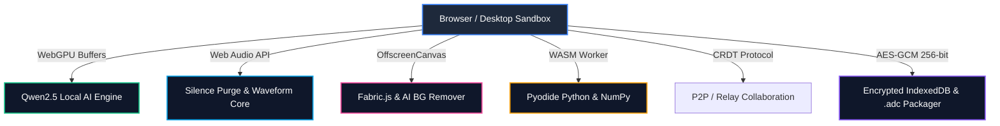

# AMEVA Workstation: Next-Gen AI-Powered Integrated Media Workspace

<div align="center">

```
   █████╗ ███╗   ███╗███████╗██╗   ██╗ █████╗     ██╗    ██╗ ██████╗ ██████╗ ██╗  ██╗███████╗████████╗ █████╗ ████████╗██╗ ██████╗ ███╗   ██╗
  ██╔══██╗████╗ ████║██╔════╝██║   ██║██╔══██╗    ██║    ██║██╔═══██╗██╔══██╗██║ ██╔╝██╔════╝╚══██╔══╝██╔══██╗╚══██╔══╝██║██╔═══██╗████╗  ██║
  ███████║██╔████╔██║█████╗  ██║   ██║███████║    ██║ █╗ ██║██║   ██║██████╔╝█████╔╝ ███████╗   ██║   ███████║   ██║   ██║██║   ██║██╔██╗ ██║
  ██╔══██║██║╚██╔╝██║██╔══╝  ╚██╗ ██╔╝██╔══██║    ██║███╗██║██║   ██║██╔══██╗██╔═██╗ ╚════██║   ██║   ██╔══██║   ██║   ██║██║   ██║██║╚██╗██║
  ██║  ██║██║ ╚═╝ ██║███████╗ ╚████╔╝ ██║  ██║    ╚███╔███╔╝╚██████╔╝██║  ██║██║  ██╗███████║   ██║   ██║  ██║   ██║   ██║╚██████╔╝██║ ╚████║
  ╚═╝  ╚═╝╚═╝     ╚═╝╚══════╝  ╚═══╝  ╚═╝  ╚═╝     ╚══╝╚══╝  ╚═════╝ ╚═╝  ╚═╝╚═╝  ╚═╝╚══════╝   ╚═╝   ╚═╝  ╚═╝   ╚═╝   ╚═╝ ╚═════╝ ╚═╝  ╚═══╝
```

### The World's First 100% On-Device WebGPU AI & In-App Multi-Media Workspace

<p align="center">
  <a href="https://ameva-workstation-web-core.vercel.app/"></a>
  <a href="https://ameva-workstation-web-core.vercel.app/promo/index.html"></a>
  <a href="https://github.com/uno-km/AMEVA-Workstation-Web/stargazers"></a>
  <a href="https://github.com/uno-km/AMEVA-Workstation-Web/network/members"></a>
  <a href="https://github.com/uno-km/AMEVA-Workstation-Web/issues"></a>
  <a href="https://github.com/uno-km/AMEVA-Workstation-Web/blob/main/LICENSE"></a>
</p>

<p align="center">
  
  
  
  
  
  
</p>

<br/>

**[브라우저에서 즉시 체험하기 (Live Demo)](https://ameva-workstation-web-core.vercel.app/)** • **[공식 쇼케이스 웹사이트 (Showcase Landing)](https://ameva-workstation-web-core.vercel.app/promo/index.html)**

외부 서버 데이터 전송 0% & 서버비 0원 — 사용자의 GPU(WebGPU)를 활용한 초고속 온디바이스 로컬 AI 추론, 비디오 타임라인 컷편집, 이미지 AI 배경제거, 오디오 무음 자동삭제, 대용량 PDF 3단계 맵리듀스, 지능형 인터랙티브 지오매핑을 단일 런타임에 통합한 차세대 지식 워크스테이션입니다.

<br/>

[빠른 시작](#빠른-시작-가이드-quick-start) • [16대 핵심 기능 매뉴얼](#16대-핵심-기능-상세-매뉴얼-complete-user-manual) • [비교 우위 분석](#기존-도구-대비-비교-우위-comparison-matrix) • [투자 및 사업계획서](#투자-및-엔터프라이즈-리소스-investor--enterprise-hub) • [단축키 & 슬래시 커맨드](#단축키-및-슬래시-커맨드-치트시트) • [보안 아키텍처](#엔터프라이즈-보안--아키텍처-security--architecture)

</div>

---

## 프로젝트 개요 (Overview)

기존 지식 근로자들은 문서 하나를 작성하기 위해 **노션(Notion), 프리미어(Premiere), 포토샵(Photoshop), 오다시티(Audacity), 구글 맵(Google Maps), ChatGPT, 엑셀(Excel) 등 평균 8개 이상의 분절된 소프트웨어**를 오가며 막대한 컨텍스트 스위칭 비용을 소비하고 있습니다.

또한 클라우드 기반 생성형 AI 도입 시 **기업의 핵심 소스코드와 대외비 문서가 외부 서버로 전송되어 기밀 유출 위기**에 직면하게 되며, 매달 감당하기 힘든 API 토큰 비용이 발생합니다.

**AMEVA Workstation은 단 하나의 통합 브라우저 런타임에서 이 문제를 근본적으로 해결합니다.**

1. **100% 온디바이스 프라이버시 (Zero Data Leakage)**: 모든 AI 추론(Qwen2.5, Whisper, Transformers.js)이 사용자 로컬 PC 그래픽카드(WebGPU)에서만 실행되며 외부 서버 전송이 0바이트입니다.
2. **올인원 멀티미디어 저작 스튜디오**: 마크다운 본문 내에서 비디오 구간 컷팅, 이미지 AI 누끼따기 및 개별 리사이징, 오디오 무음 자동 감지 및 삭제를 직접 수행합니다.
3. **초고속 문서 인텔리전스**: PDF/DOCX/PPTX/HWPX 대용량 문서를 3초 Fast-Pass 및 3단계 맵리듀스로 챕터별 카드 덱으로 요약합니다.
4. **지능형 지오매핑**: OpenStreetMap 기반 다중 핀 꽂기 및 OSRM 추천 경로를 실시간으로 문서에 직렬화 저장합니다.
5. **서버 운영비 0원 (Zero Server Dependency)**: 모든 연산을 클라이언트 디바이스가 전담하므로 백엔드 인프라 유지비가 제로($0)에 수렴합니다.

---

## 16대 핵심 기능 상세 매뉴얼 (Complete User Manual)

```
┌──────────────────────────────────────────────────────────────────────────────────────────────────┐
│                                 AMEVA WORKSTATION SYSTEM ARCHITECTURE                            │
├──────────────────────────────┬──────────────────────────────┬────────────────────────────────────┤
│ Multi-Media Studio           │ Document Intelligence        │ WebGPU Engine & AI Compute         │
│ • Video Timeline Trim & 8-Dir│ • PDF/DOCX/PPTX/HWPX Parser  │ • Qwen2.5 0.5B/1.5B/7B WebLLM      │
│ • Image Canvas & AI BG-Remove│ • 3s Fast-Pass Quick Summary │ • Mini-Colab WGSL Shader PyTorch   │
│ • Audio Waveform Visualizer  │ • 3-Stage Map-Reduce Deck    │ • Local RAG & Vector Embeddings    │
│ • Silence Auto-Purge Core    │ • Multi-Card Deck Insertion  │ • Contextual Neural Translation    │
├──────────────────────────────┼──────────────────────────────┼────────────────────────────────────┤
│ Geo-Mapping & Navigation     │ Advanced Block Suite         │ Enterprise Security & Architecture │
│ • OpenStreetMap Live Geocode │ • FortuneSheet Native Excel  │ • 100% On-Device Zero-Server Leak  │
│ • Multi-Pin Point Drops      │ • Excalidraw Whiteboard      │ • Encrypted Local VFS & .adc       │
│ • OSRM Dynamic Route Engine  │ • Drag & Drop Kanban Board   │ • Y.js P2P/Relay CRDT Sync Engine  │
│ • Markdown Persistence Sync  │ • Pyodide WASM & Mermaid Fix │ • 8-Format Native Lossless Export  │
└──────────────────────────────┴──────────────────────────────┴────────────────────────────────────┘
```

---

### 1. 멀티미디어 인앱 저작 스튜디오 (Video / Image / Audio)
* **비디오 타임라인 컷편집 & 8방향 비례 리사이저 (`/video`)**:
  * 에디터 본문에서 재생 막대 좌우 트림 핸들을 조절하여 원하는 시작/종료 시간(`startTime`, `endTime`)을 초 단위로 자릅니다.
  * 8개 방향 모서리 핸들을 잡고 드래그하여 영상의 가로/세로 비율을 자유자재로 리사이징할 수 있으며, 미리보기 모드에서는 조절 바가 숨겨져 깔끔하게 렌더링됩니다.
* **이미지 갤러리 & Fabric.js 캔버스 스튜디오 (`/image`)**:
  * 단일 사진뿐 아니라 격자(Grid) 및 좌우 가로 스크롤 캐러셀(Carousel) 형태의 다중 사진 레이아웃 지원.
  * **개별 사진 8방향 리사이저 (`ResizableImageCard`)**: 사진마다 실시간 해상도 툴팁(px)과 함께 개별 크기를 조절하고 영구 저장.
  * **AI 1초 배경 제거 (Remove Background)**: 온디바이스 비전 모델을 통해 인물/제품 사진의 배경을 1초 만에 투명 누끼 PNG로 분리.
  * **인앱 캔버스 드로잉/필터/텍스트 오버레이**: 크롭, 회전, 밝기/대비 조절, 브러시 드로잉 지원.
* **오디오 파형 스튜디오 & 무음존 자동 삭제 (`/audio`)**:
  * Web Audio API 기반의 실시간 주파수 진폭 파형(Waveform) 시각화.
  * **무음존 자동 감지 및 1-클릭 일괄 삭제 (Silence Detection & Purge)**: 회의 녹음이나 강의 음성에서 말이 없는 무음 구간(Silence Threshold)을 알고리즘이 밀리초 단위로 자동 식별하여 단 한 번의 클릭으로 일괄 컷팅 압축합니다.

---

### 2. 온디바이스 WebGPU 문서 인텔리전스 & 맵리듀스 요약 덱 (`/doc`)
* **지원 포맷**: **PDF**(`.pdf`), **MS Word**(`.docx`), **PowerPoint**(`.pptx`), **한글**(`.hwpx`) 네이티브 파싱 및 뷰어.
* **3초 Fast-Pass 고속 요약**: 1~3페이지 분량의 소형 문서는 3~4초 만에 핵심 요약과 키워드를 즉시 도출.
* **대용량 3단계 맵리듀스 (Map-Reduce)**: 수십~수백 페이지의 방대한 문서를 챕터별로 클러스터링 분할(Map) 후 취합(Reduce)하여 **다단계 요약 카드 덱(Document Summaries Deck)**을 생성하며, 원하는 단락 카드만 골라 본문에 1-클릭 블록으로 삽입할 수 있습니다.

---

### 3. Mini-Colab & 브라우저 WebGPU 텐서 연산 셰이더 (`/colab`)
* **브라우저 네이티브 WGSL 셰이더 브릿지 (`gpuCore.ts`)**:
  * 파이썬 서버나 CUDA 설치 없이도 브라우저 내부에서 WebGPU 셰이더(`matmul.wgsl`, `elementwise.wgsl`)를 직접 컴파일하여 초당 수십억 회의 행렬곱 및 딥러닝 텐서 연산을 고속 병렬 처리합니다.

---

### 4. Knowledge Graph 3D/2D 지식 관계망 시각화 뷰어 (`/graph`)
* **인터랙티브 포스-지향 지식 그래프 (Force-Directed Knowledge Graph)**:
  * 문서 내 키워드, 태그, 헤딩, 블록 간의 유기적 연결 관계를 3D/2D 인터랙티브 그래프 노드로 렌더링.
  * 백그라운드 웹 워커(`graphWorker.ts`) 기반 물리 엔진으로 수천 개 노드도 60fps로 매끄럽게 탐색합니다.

---

### 5. FortuneSheet 완전 호환 인앱 엑셀 스프레드시트 (`/excel`)
* **MS Excel `.xlsx` 무손실 양방향 임포트/익스포트**:
  * 엑셀 파일을 에디터로 드래그하면 시트 서식, 다중 탭, 함수 수식(SUM, AVERAGE, VLOOKUP 등), 셀 스타일이 그대로 유지된 채 인터랙티브 스프레드시트로 즉시 작동합니다.

---

### 6. Excalidraw 완전 내장 화이트보드 드로잉 (`/drawing`)
* 자유형 손그림 스케치, 시스템 아키텍처 다이어그램, UI 와이어프레임, 플로우차트 작성을 위한 Excalidraw 벡터 캔버스 완전 내장.

---

### 7. 인라인 인터랙티브 칸반 보드 (`/kanban`)
* 마크다운 본문 내부에서 드래그 앤 드롭으로 To Do, In Progress, Done 카드를 이동 관리할 수 있는 인터랙티브 업무 관리 보드.

---

### 8. 인터랙티브 지오매핑 & 최적 경로 탐색 시스템 (`/map`)
* **장소/주소 실시간 검색**: OpenStreetMap Nominatim 지오코딩 엔진 연동.
* **다중 핀 꽂기 & 최적 경로 탐색 (OSRM Navigation)**:
  * 지도 위 원하는 지점들에 마커를 꽂고, 출발지-경유지-도착지 간 최적 이동 경로 라인을 지도에 시각화.
  * 현장 사진, 메모, GPS 좌표가 마크다운 문서에 안전하게 직렬화 저장되어 미리보기 모드에서도 상시 인터랙티브하게 조작 가능합니다.

---

### 9. 파이썬 WASM 샌드박스 & HTML 라이브 런타임 (`/jupyter`, `/code`)
* **Pyodide WASM 파이썬 엔진**: 별도 백엔드 없이 브라우저 내에서 NumPy, Pandas, Matplotlib, SciPy 코드를 직접 실행하고 고해상도 차트를 즉시 렌더링.
* **HTML/JS/CSS Live Sandbox**: 웹 컴포넌트 실시간 프리뷰 샌드박스 내장.

---

### 10. Mermaid 다이어그램 지능형 문법 자동 보정기 (`/mermaid`)
* Flowchart 작성 시 흔히 발생하는 콜론 문법 오류(`A --> B: 라벨`)나 세미콜론 줄바꿈 누락을 내부 파서(`sanitizeMermaidCode`)가 감지하여 올바른 표준 문법(`A -->|라벨| B`)으로 1초 만에 자동 보정 렌더링합니다.

---

### 11. 신경망 실시간 번역 & 4대 맞춤형 문체 다듬기
* **온디바이스 신경망 번역 (Neural Translation)**: 한국어 ⇄ 영/일/중/스페인/프랑스/독일어 100% 로컬 WebGPU 번역.
* **4대 문체 변환 (Tone Polishing)**: 학술/논문체, 비즈니스 격식체, 친근한 캐주얼체, 개발자/기술 문서체.
* **실시간 AI Diff 비교 뷰어**: 원본과 수정본을 한눈에 비교하고 1-클릭으로 본문에 적용.

---

### 12. 차세대 자율 AI 에이전트 & 로컬 RAG 패널 (`Cmd/Ctrl + L`)
* Qwen2.5 온디바이스 가속 추론, 로컬 벡터 스토어 RAG, **에디터 도구 자율 호출 (Tool Calling)**을 통해 표 자동 생성, 수식 계산, 코드 디버깅을 자율 수행.

---

### 13. 유튜브 타임스탬프 & 스마트 링크 프리뷰 (`/youtube`, `/link`)
* 유튜브 영상 특정 시간대 메모 재생 및 웹 URL 입력 시 실시간 오픈그래프 카드 렌더링.

---

### 14. Presentation 모드 (1-클릭 슬라이드 쇼 변환)
* 마크다운 문서 내용을 클릭 한 번으로 미려한 풀스크린 발표용 PPT 슬라이드로 전환.

---

### 15. 8대 포맷 네이티브 무손실 내보내기 (Export Hub)
* **지원 내보내기 규격**: `.docx`, `.pptx`, `.hwpx`, `.xlsx`, `.pdf`, `.html`, `.xml`, `.adc` (통합 암호화 아카이브).

---

### 16. 인앱 확장 마켓플레이스 & 실시간 문서 미니맵 (Minimap)
* 커스텀 블록, AI 프롬프트 템플릿 마켓플레이스 및 대용량 문서 레이더 탐색 미니맵 내장.

---

## 기존 도구 대비 비교 우위 (Comparison Matrix)

| 비교 항목 | 전통적 SaaS (Notion AI / MS Copilot) | 로컬 에디터 (Obsidian / Logseq) | AMEVA Workstation |
| :--- | :--- | :--- | :--- |
| **데이터 보안 / 프라이버시** | 클라우드 서버 전송 (기밀 유출 위험) | 텍스트 로컬 저장 (AI 기능 부재) | **100% WebGPU 로컬 추론 (외부 전송 0byte)** |
| **서버 API 토큰 비용** | 유저당 월 $10~$30 과금 | AI 플러그인 시 OpenAI 유료 키 필요 | **하드웨어 가속으로 추가 비용 $0** |
| **비디오 / 오디오 스튜디오** | 불가 (외부 툴 필요) | 플러그인 전무 | **타임라인 컷팅 & 무음존 자동 삭제 내장** |
| **이미지 가공 & AI 누끼** | 단순 업로드만 지원 | 불가 | **Fabric.js 캔버스 + AI 1초 배경제거** |
| **대용량 문서 분석 (PDF/Doc)**| 페이지 수 제한 및 유료 크레딧 소모 | 불가 | **3초 Fast-Pass & 3단계 맵리듀스 덱** |
| **인터랙티브 지오매핑** | 정적 캡처만 가능 | 단순 지도 뷰어 수준 | **다중 핀 + OSRM 최적 경로 탐색 직렬화** |
| **엑셀 / 파이썬 WASM** | 정적 테이블만 지원 | 복잡한 추가 설정 필요 | **FortuneSheet + Pyodide 완전 내장** |

---

## 단축키 및 슬래시 커맨드 치트시트

### 주요 키보드 단축키
* `Ctrl/Cmd + S`: 로컬 문서 즉시 저장
* `Ctrl/Cmd + O`: 마크다운 / 텍스트 / ADC 파일 열기
* `Ctrl/Cmd + N`: 새 문서 생성
* `Ctrl/Cmd + L` 또는 `Ctrl/Cmd + \`: 자율 AI 에이전트 패널 토글
* `Ctrl/Cmd + P`: 인쇄 및 고해상도 PDF 내보내기
* `Ctrl/Cmd + H`: 에디터 ↔ 프리뷰 분할(Split) 화면 전환
* `Ctrl/Cmd + F`: 문서 내 실시간 찾기 및 바꾸기(Find & Replace)
* `Ctrl/Cmd + K`: 하이퍼링크 삽입
* `Ctrl/Cmd + +` / `Ctrl/Cmd + -` / `Ctrl/Cmd + 0`: 줌 인/아웃/리셋

### 슬래시 커맨드 (`/` 입력 시 호출)
| 슬래시 명령어 | 기능 설명 |
| :--- | :--- |
| `/video` | 비디오 타임라인 컷편집 및 8방향 리사이저 블록 삽입 |
| `/image` | 다중 사진 갤러리, Fabric.js 드로잉, AI 배경제거 블록 삽입 |
| `/audio` | 오디오 파형 시각화 및 무음존 자동 감지/삭제 블록 삽입 |
| `/doc` | PDF, DOCX, PPTX, HWPX 뷰어 및 3초 고속 요약 덱 삽입 |
| `/colab` | 브라우저 WebGPU WGSL 셰이더 행렬곱/PyTorch 런타임 삽입 |
| `/graph` | 2D/3D Force-Directed Knowledge Graph 지식 관계망 삽입 |
| `/excel` | MS Excel 완전 호환 인앱 스프레드시트 블록 삽입 |
| `/drawing` | Excalidraw 화이트보드 손그림/아키텍처 캔버스 삽입 |
| `/kanban` | 드래그 앤 드롭 업무 관리 칸반 보드 삽입 |
| `/map` | Leaflet 다중 핀 꽂기 및 OSRM 추천 경로 탐색 블록 삽입 |
| `/jupyter` | NumPy, Pandas, Matplotlib 실행 가능한 Pyodide 파이썬 블록 |
| `/mermaid` | 문법 오류 자동 보정 기능이 탑재된 Mermaid 다이어그램 블록 |
| `/youtube` | 타임스탬프 구간 메모 재생 유튜브 블록 삽입 |

---

## 엔터프라이즈 보안 & 아키텍처 (Security & Architecture)



* **Zero-Knowledge Privacy Protocol**: 모든 미디어 파일, 문서 데이터, 프롬프트는 사용자의 로컬 브라우저 IndexedDB에 저장되며 외부 클라우드로 단 1바이트도 전송되지 않습니다.
* **망분리 기업 완벽 호환**: 인터넷 연결이 차단된 폐쇄망(금융, 군사, 방산, 의료, 정부기관) 환경에서도 100% 모든 기능이 오프라인으로 작동합니다.

---

## 투자 및 엔터프라이즈 리소스 (Investor & Enterprise Hub)

* **[실리콘밸리 YC / VC 표준 12슬라이드 IR Pitch Deck](docs/IR_PITCH_DECK.md)**
* **[정부지원사업(예창패/초창패/TIPS) 표준 PSST 사업계획서](docs/GOV_STARTUP_BUSINESS_PLAN_PSST.md)**
* **[공식 쇼케이스 랜딩 페이지 (Showcase Landing)](https://ameva-workstation-web-core.vercel.app/promo/index.html)**
* **투자 및 B2B 온프레미스 라이선스 문의**: team@ameva.io

---

## 빠른 시작 가이드 (Quick Start)

### 웹 브라우저에서 즉시 실행
별도의 설치나 가입 없이 아래 링크에서 바로 실행할 수 있습니다:  
**[https://ameva-workstation-web-core.vercel.app/](https://ameva-workstation-web-core.vercel.app/)**

### 로컬 개발 환경 구축
```bash
# 1. 저장소 복제
git clone https://github.com/uno-km/AMEVA-Workstation-Web.git
cd AMEVA-Workstation-Web

# 2. 의존성 패키지 설치
npm install

# 3. 개발 서버 구동 (포트 8888)
npm run dev

# 4. 프로덕션 번들 빌드
npm run build
```

---

## Trending Topics & Keywords

`#AMEVA` `#WebGPU` `#OnDeviceAI` `#LocalLLM` `#Qwen25` `#MarkdownEditor` `#VideoEditor` `#AudioSilenceRemoval` `#BackgroundRemoval` `#DocIntelligence` `#MapReduce` `#KnowledgeGraph` `#Excalidraw` `#FortuneSheet` `#Pyodide` `#WASM` `#Leaflet` `#OpenStreetMap` `#ZeroServerLeakage` `#PrivacyFirst` `#NotionAlternative` `#ObsidianAlternative` `#SiliconValley` `#YCombinator` `#TIPS` `#Productivity` `#OpenSource` `#DeveloperTools`

---

<div align="center">

**AMEVA Workstation** • *Crafted with Architectural Precision by uno-km*  
Released under **MIT License** • **v0.8.19**

</div>
