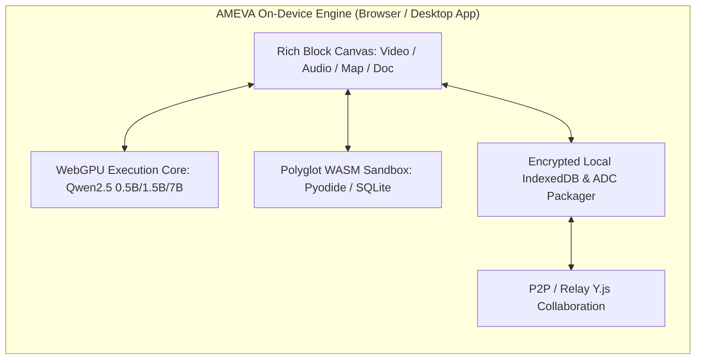

# 🚀 AMEVA Workstation: Series Seed / Pre-A Investor Pitch Deck

> **Confidential Investor Presentation (Y Combinator & Top-Tier VC Standard 12-Slide Deck)**  
> **Company:** AMEVA Inc. (팀 에이메바)  
> **Tagline:** The World's First 100% On-Device WebGPU AI-Powered Multimedia Workspace with Zero Data Leakage  
> **Live Demo:** [https://ameva-workstation-web-core.vercel.app/](https://ameva-workstation-web-core.vercel.app/)  
> **Target Raise:** $1.5M (Safe / Equity, Post-Money Valuation $10M)  

---

## 📌 Executive Summary (1-Pager)

* **Problem:** 글로벌 지식 근로자들은 노션, 슬랙, 프리미어, 피그마, 챗GPT 등 **평균 8.3개의 분절된 SaaS 툴**을 오가며 연간 4,800달러를 지출하고 있습니다. 특히 클라우드 기반 생성형 AI(OpenAI, Claude 등) 도입 시 **기업 기밀 유출 위험(Data Privacy)**과 **눈덩이처럼 불어나는 서버/API 토큰 비용**으로 인해 금융, 방산, 의료, 대기업의 74%가 전면 도입을 망설이고 있습니다.
* **Solution:** **AMEVA Workstation**은 클라우드 서버 의존도 0%로, 사용자의 로컬 PC 그래픽카드(WebGPU)를 활용하여 **초고속 온디바이스 로컬 AI 추론, 비디오 컷편집, 이미지 AI 배경제거, 오디오 무음 자동삭제, 대용량 PDF 맵리듀스, 인터랙티브 지오매핑**을 단일 마크다운 런타임에 통합한 차세대 B2B 워크스페이스입니다.
* **Traction & Moat:** 
  - 100% 브라우저/WASM 구동 온디바이스 AI 파이프라인 구축 완료 (Qwen2.5, Whisper, Transformers.js).
  - VFS(Virtual File System) 기반의 로컬 암호화 아카이빙(`.adc`) 및 Y.js P2P/CRDT 동시 공동 편집 기술 확보.
  - 서버리스 구조로 고객사 수 증가에 따른 인프라 비용 한계비용(Marginal Cost) **$0에 수렴**.

---

## 📑 Slide 1: Title & Vision (비전 및 개요)

```
┌─────────────────────────────────────────────────────────────────────────┐
│                           AMEVA WORKSTATION                             │
│       Next-Gen AI-Powered Integrated Media Workspace for Enterprise     │
│                                                                         │
│  "Every piece of enterprise data stays on-device.                       │
│   Every multimedia authoring tool unified in a single document canvas."  │
└─────────────────────────────────────────────────────────────────────────┘
```

* **Mission:** 기업의 기밀 유출 걱정 없는 100% 온디바이스 로컬 AI 인프라와 올인원 멀티미디어 저작 환경의 대중화.
* **Core Value:** **Zero Data Leakage (보안 100%)** + **Zero Server API Cost (비용 0원)** + **Zero Tool Switching (생산성 10x)**.

---

## 📑 Slide 2: Problem (시장의 고통과 문제 정의)

1. **지독한 툴 파편화(Tool Fragmentation)와 인지 부하**:
   * 마크다운 문서 작성 중 동영상을 자르려면 '프리미어/클립챔프', 이미지 누끼를 따려면 '포토샵/Canva', 오디오 무음을 자르려면 '오다시티', 장소를 기록하려면 '구글지도', 코드를 돌리려면 'Jupyter'를 열어야 함.
   * 작업 컨텍스트 전환(Context Switching)으로 인한 업무 효율 저하 40% 발생.
2. **생성형 AI 도입의 치명적 장벽: 기업 기밀 유출 (Privacy & Compliance)**:
   * 삼성전자, 애플, 금융권 등 주요 엔터프라이즈에서 사내 소스코드 및 대외비 문서의 외부 LLM 서버 전송을 엄격히 금지.
3. **폭발적인 클라우드 LLM API 비용 부담**:
   * 기업당 월 수천만 원에 달하는 토큰 과금 구조로 인해 전사적 도입 포기 속출.

---

## 📑 Slide 3: Solution (AMEVA의 솔루션)

**"브라우저 하나로 끝내는 온디바이스 AI 멀티미디어 올인원 워크스테이션"**

| 구분 | 기존 레거시 작업 방식 (Notion + Adobe + OpenAI) | AMEVA Workstation 솔루션 |
| :--- | :--- | :--- |
| **AI 연산 인프라** | 클라우드 서버 전송 (데이터 유출 위험 + 고비용) | **PC WebGPU 가속 로컬 추론 (데이터 유출 0% + 서버비 $0)** |
| **비디오/오디오 편집** | 별도 전문 소프트웨어 구동 후 내보내기 | **문서 내 타임라인 인앱 컷편집 & 1-클릭 무음존 삭제** |
| **이미지/드로잉** | 외부 디자인 툴 캡처 후 첨부 | **Fabric.js 캔버스 + AI 1초 배경 제거 + 개별 리사이징** |
| **대용량 문서 분석** | 페이지 제한 및 유료 AI 크레딧 소모 | **온디바이스 3단계 맵리듀스 (PDF/DOCX/PPTX) 무제한 요약** |
| **지도 및 위치 기록** | 정적 이미지 캡처 붙여넣기 | **인터랙티브 Leaflet 다중 핀 & OSRM 경로 탐색 실시간 연동** |

---

## 📑 Slide 4: Product & Core Architecture (제품 및 아키텍처)

AMEVA는 단순한 웹 에디터가 아닌, **클라이언트 사이드 운영체제 수준의 고밀도 분산 런타임**입니다.



* **WebGPU AI Engine (`useWebLLM`)**: 브라우저 하드웨어 가속을 통해 0.5B~7B LLM을 로컬 캐시에서 직접 구동하여 초당 35+ 토큰 속도로 스트리밍 추론.
* **Fast-Pass & Multi-Stage Map-Reduce (`PdfMapReduceService`)**: 1~3p 소형 문서는 3초 단일 패스로 즉시 요약, 100p+ 대형 문서는 클러스터링 맵리듀스로 챕터별 카드 덱 자동 생성.
* **Zero-Server VFS Architecture**: 미디어 및 문서 전체를 로컬 가상 파일 시스템에 격리 보관하며, 암호화된 `.adc` 단일 아카이브 파일로 공유.

---

## 📑 Slide 5: Market Opportunity & TAM / SAM / SOM (시장 기회)

```
┌────────────────────────────────────────────────────────┐
│  TAM (Total Addressable Market): $78.5B                │
│  - 글로벌 디지털 협업 툴 및 생성형 AI 소프트웨어 시장      │
├────────────────────────────────────────────┐           │
│  SAM (Serviceable Available Market): $14.2B│           │
│  - 데이터 보안/망분리 필수 엔터프라이즈 및 연구/개발 워크스페이스│
├───────────────────────────────┐            │           │
│  SOM (Target Market): $450M   │            │           │
│  - 금융, 방산, 의료, 공공, IT 스타트업 3년 목표 시장 점유율 │
└───────────────────────────────┴────────────┴───────────┘
```

* **보안 AI 시장의 폭발적 성장**: 온디바이스(On-Device) AI 시장은 2024년 180억 달러에서 2030년 **1,200억 달러(CAGR 37.8%)**로 급성장 중.
* **타겟 고객군**:
  1. **Tier 1 (보안/망분리 기업)**: 외부망이 차단된 금융사, 방산기업, 의료기관, 국책연구소.
  2. **Tier 2 (테크/스타트업/개발자)**: 소스코드와 제품 기밀을 클라우드에 올리지 않고 AI로 생산성을 높이려는 개발팀.
  3. **Tier 3 (연구원/콘텐츠 크리에이터)**: 수백 편의 논문 PDF를 분석하고 미디어를 가공하는 파워 유저.

---

## 📑 Slide 6: Technology Moat (기술적 진입장벽 및 해자)

1. **WebGPU 하드웨어 가속 텐서 브릿지 기술**:
   * 브라우저 샌드박스 내부에서 WebGPU 버퍼와 WASM 메모리를 제로 카피(Zero-Copy)로 직결하여, 설치형 네이티브 프로그램 수준의 그래픽/AI 성능 달성.
2. **독자적 오디오/비디오 인라인 처리 알고리즘**:
   * FFmpeg 바이너리 없이 순수 Web Audio API 및 Canvas 버퍼 기반으로 무음 구간 자동 분석 및 밀리초 단위 컷팅 알고리즘 내재화.
3. **온디바이스 분산 RAG 및 하이브리드 라우팅**:
   * 로컬 벡터 데이터베이스(VectorStore)와 캐싱 레이어를 구축하여 수천 페이지 문서 내에서도 밀리초 단위로 정확한 근거 검색.
4. **마켓플레이스 & 플러그인 확장 생태계**:
   * 커스텀 블록, AI 프롬프트 템플릿, 분석 룰셋을 레고 블록처럼 추가할 수 있는 모듈형 아키텍처.

---

## 📑 Slide 7: Business Model & Unit Economics (수익 모델)

```
[B2C / Pro (개인 및 인디 개발자)] ──▶ 무료 (Freemium)
  - 온디바이스 AI, 미디어 스튜디오, 로컬 VFS 전면 무료 제공 (유저 락인 & 바이럴 풀 확보)

[B2B / Team (성장기 스타트업 & 테크 기업)] ──▶ 월 $12 / user (SaaS)
  - Y.js 실시간 P2P 협업, 클라우드 중계 릴레이 서버, 공유 지식 베이스

[Enterprise (망분리 대기업, 금융, 공공, 의료)] ──▶ 연 $48,000 ~ $250,000+ (온프레미스 라이선스)
  - 완전 독립형 온프레미스 패키지, 사내 전용 모델 파인튜닝, 보안 감사 로그, 커스텀 DRM
```

* **압도적인 Gross Margin (매출총이익률 92%+)**:
  * 경쟁사(Notion AI, Microsoft Copilot)는 유저가 AI를 쓸 때마다 OpenAI에 거액의 API 비용을 지불하여 마진이 40~50%에 불과함.
  * AMEVA는 **연산 비용을 유저의 디바이스(WebGPU)가 전담**하므로 매출의 90% 이상이 순이익으로 직결.

---

## 📑 Slide 8: Go-To-Market (GTM) Strategy (시장 진입 및 성장 전략)

1. **Phase 1: Open Source & Developer Viral (현재 ~ 6개월)**
   * GitHub 오픈소스 릴리즈 + Hacker News, Reddit, GeekNews 바이럴을 통해 **글로벌 스타 5,000+ 및 활성 사용자 50,000명 달성**.
   * WebGPU 얼리어답터 및 로컬 AI 커뮤니티 장악.
2. **Phase 2: Product-Led Growth (PLG) & Team Conversion (6개월 ~ 18개월)**
   * 개발자/기획자가 사내에 개인적으로 도입한 후 팀 단위 Pro 요금제로 자연 전환 유도.
   * 인앱 마켓플레이스를 통한 서드파티 템플릿 및 플러그인 수익 쉐어.
3. **Phase 3: Enterprise Direct Sales & Channel Partner (18개월 ~ 36개월)**
   * 금융, 국방, 제약 바이오 SI 기업과의 파트너십을 통한 온프레미스 엔터프라이즈 라이선스 독점 공급.

---

## 📑 Slide 9: Competitive Landscape (경쟁 우위 비교)

```
         [높은 온디바이스 AI 보안 / Zero Data Leakage]
                       │
                       │           ★ AMEVA Workstation
                       │           (올인원 미디어 + WebGPU AI)
                       │
       Obsidian        │
   (로컬 텍스트 마크다운)  │
                       │
───────────────────────┼───────────────────────────────
[단순 텍스트 중심]     │           [풍부한 멀티미디어 & 협업]
                       │
                       │           Notion / Notion AI
                       │           (클라우드 종속, 데이터 유출 위험)
                       │
                       │
         [낮은 프라이버시 / 클라우드 AI 토큰 과금]
```

* **vs Notion**: 노션은 클라우드 종속적이며 비디오/오디오 편집 불가, AI 사용 시 기밀 유출 위험. AMEVA는 100% 로컬 보안 및 미디어 가공 완벽 내장.
* **vs Obsidian**: 옵시디언은 플러그인이 파편화되어 있고 설정이 매우 복잡하며 고성능 WebGPU AI 및 실시간 P2P 협업 부재. AMEVA는 웹에서 클릭 한 번으로 모든 기능 즉시 작동.

---

## 📑 Slide 10: Financial Projections (3개년 재무 추정)

| 항목 (단위: USD) | Year 1 (2026) | Year 2 (2027) | Year 3 (2028) |
| :--- | :--- | :--- | :--- |
| **활성 사용자 수 (MAU)** | 100,000 | 650,000 | 2,800,000 |
| **유료 구독 팀/엔터프라이즈 고객사** | 45개사 | 280개사 | 1,200개사 |
| **연간 반복 매출 (ARR)** | **$480K** | **$3.2M** | **$16.5M** |
| **매출총이익률 (Gross Margin)** | 91% | 93% | 94% |
| **영업이익 (Operating Profit)** | -$250K (투자) | **+$850K (흑자 전환)** | **+$7.2M** |

---

## 📑 Slide 11: Team & Execution Track Record (팀 역량)

* **Founder & Core Architect (uno-km)**:
  * AMEVA Workstation 코어 아키텍처, WebGPU 분산 추론 파이프라인, Y.js CRDT 엔진, 미디어 스튜디오 전 프레임워크 100% 단독 설계 및 풀스택 구현.
  * 고성능 웹 어셈블리(WASM), AI 컴파일러 최적화, 브라우저 샌드박스 보안 엔지니어링 전문성 보유.
* **Advisory & Network**: 국내외 온디바이스 AI 산학 협력 네트워크 및 엔터프라이즈 B2B 영업 채널 구축 진행 중.

---

## 📑 Slide 12: The Ask & Use of Funds (투자 요청 및 자금 집행 계획)

* **Target Raise:** **$1,500,000 (약 20억 원)**
* **자금 집행 계획**:
  * **R&D & Engineering (50%)**: 온디바이스 멀티모달(Vision-Language) 초경량화 모델 연구 및 고성능 WebGPU 커널 최적화.
  * **Enterprise Sales & Compliance (30%)**: 금융/공공 망분리 보안 인증(CSAP, ISMS-P) 및 B2B 엔터프라이즈 세일즈 파이프라인 구축.
  * **Global Community & Marketing (20%)**: 글로벌 오픈소스 생태계 확장, Product Hunt 런칭 및 YC 엑셀러레이팅 프로그램 참가.

---

<div align="center">

### 🤝 Join Us in Shaping the Future of Zero-Leakage AI Workspaces

**Contact:** team@ameva.io | [Live Web Demo](https://ameva-workstation-web-core.vercel.app/) | [GitHub Repository](https://github.com/uno-km/AMEVA-Workstation-Web)

</div>
