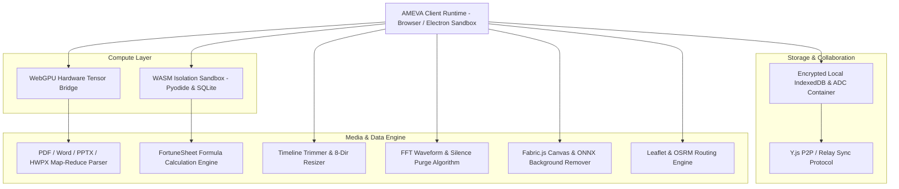
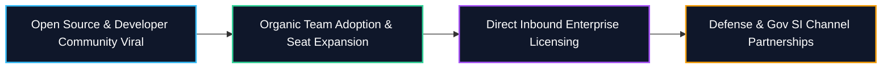

# AMEVA Workstation: Series Seed / Pre-A Investor Pitch Deck

```
CONFIDENTIAL INVESTOR PRESENTATION
Target Round: $1,500,000 USD (SAFE / Priced Equity, Post-Money Valuation $10,000,000 USD)
Company: AMEVA Inc.
Lead Architect: Uno Kim (uno-km)
Live Application: https://ameva-workstation-web-core.vercel.app/
Official Showcase: https://ameva-workstation-web-core.vercel.app/promo/index.html
GitHub Repository: https://github.com/uno-km/AMEVA-Workstation-Web
Contact: team@ameva.io
```

---

## Executive Summary (1-Pager)

AMEVA Workstation is the world's first fully on-device, WebGPU-accelerated multimedia markdown operating workspace designed for privacy-critical enterprise environments.

### The Fundamental Market Failure
Global knowledge workers switch between an average of 8.3 fragmented SaaS applications daily (Notion, Adobe Premiere, Photoshop, Audacity, Google Maps, ChatGPT, Excel), losing over 40% of productive hours to context switching. More critically, as enterprises rush to adopt Generative AI, cloud-based LLM architectures (OpenAI, Anthropic, Microsoft Copilot) introduce catastrophic data exfiltration risks and exponentially scaling API token bills. Over 74% of regulated enterprises in defense, finance, healthcare, and semiconductor manufacturing have restricted or banned public cloud AI due to compliance mandates.

### The AMEVA Breakthrough
AMEVA unifies local on-device LLM inference (Qwen2.5, Whisper, Transformers.js via WebGPU), in-app video timeline trimming, canvas image editing with instant background removal, automated audio silence purge, multi-format document map-reduce intelligence (PDF, DOCX, PPTX, HWPX), and interactive geospatial mapping into a single, cohesive document canvas.

### The Economic & Technical Moat
* 0 Byte External Data Leakage: 100% of tensor operations, media processing, and document indexing execute directly inside client-side GPU hardware.
* Marginal Server Infrastructure Cost Approaching $0: By offloading compute workloads to user hardware, AMEVA maintains a 92%+ Gross Margin, fundamentally disrupting the unit economics of traditional AI SaaS platforms.
* Fully Functional TRL 7 Product: Production-ready browser, PWA, and desktop builds operating at sub-millisecond local latency.

---

## Slide 1: Company Vision & Core Mission

```
+--------------------------------------------------------------------------------------------------+
|                                        AMEVA WORKSTATION                                         |
|                 The Sovereign On-Device AI & Multimedia Operating Canvas                         |
|                                                                                                  |
|   "Every byte of enterprise intelligence remains sovereign on client hardware.                   |
|    Every multimedia authoring pipeline unified in a zero-latency document canvas."               |
+--------------------------------------------------------------------------------------------------+
```

### Vision Statement
To establish the global standard for sovereign knowledge management by replacing fragmented, data-leaking cloud tools with a secure, on-device AI workspace that requires zero server infrastructure and zero third-party API dependencies.

### Core Value Pillars
1. Zero Data Leakage: Complete regulatory compliance with air-gapped security for military, financial, and medical domains.
2. Zero Server Compute Overhead: Pure client-side WebGPU acceleration eliminating server-side token costs.
3. Zero Context Switching: In-app video, image, audio, data sheet, diagram, and code execution engines embedded natively in markdown.

---

## Slide 2: The Trillion-Dollar Problem

### 1. Enterprise Data Exfiltration in the Cloud AI Era
Cloud-hosted LLM solutions require transmitting confidential corporate intellectual property (source code, financial ledgers, clinical trials, internal memos) across public networks to remote data centers.
* High-profile corporate IP leaks have forced global industry leaders (Samsung, Apple, JPMorgan Chase, Citigroup) to ban or severely throttle internal cloud AI usage.
* On-premise enterprise server deployments require millions of dollars in capital expenditure for dedicated NVIDIA H100 clusters, creating an impassable barrier for SMBs and scaling enterprises.

### 2. Extreme SaaS Tool Fragmentation & Cognitive Friction
Knowledge workers suffer from severe productivity fragmentation:
* Document authoring: Notion / Confluence
* Video trimming & resizing: Premiere Pro / Clipchamp
* Image editing & background removal: Photoshop / Canva
* Audio editing & silence removal: Audacity
* Data calculation: Microsoft Excel / Google Sheets
* Geographic logging: Google Maps
* Code & chart execution: Jupyter Notebook

The average enterprise pays over $4,800 USD annually per seat across these point solutions while suffering a 40% loss in deep-work efficiency due to continuous context switching.

### 3. Compounding Cloud Token Billing
As AI adoption scales across an enterprise, recurring API token costs scale linearly with team size and document volume, eroding operating margins and creating unpredictable monthly OPEX liabilities.

---

## Slide 3: The AMEVA Solution

AMEVA collapses the entire enterprise productivity stack into a single sovereign canvas powered by client-side WebGPU compute.

| Evaluation Dimension | Legacy Cloud Stack (Notion + Adobe + OpenAI) | AMEVA Sovereign Workstation |
| :--- | :--- | :--- |
| Data Privacy & Governance | High Risk: Data transmitted to third-party servers | Absolute Sovereign: 0 bytes leave client GPU |
| AI Compute Cost | $10 to $30 / user / month in recurring token bills | $0 Marginal Compute Cost: Client WebGPU powered |
| Air-Gapped Network Support | Impossible: Requires constant internet connectivity | Native: 100% operational in disconnected military networks |
| Media Authoring Latency | High: Requires export, external tool launch, re-import | Zero: In-canvas trimming, silence removal, canvas drawing |
| Document Analysis Scale | Strict token limits, costly cloud vector ingestion | On-device 3-stage Map-Reduce with Fast-Pass caching |
| Data Format Compatibility | Vendor lock-in (proprietary cloud databases) | Universal: Native Markdown, .docx, .xlsx, .pdf, .adc |

---

## Slide 4: Deep Product Architecture & 16-Core Capability Suite



### Comprehensive 16-Core Capability Breakdown

1. In-App Video Studio: Sub-second timeline trimming (`startTime`, `endTime`), 8-direction proportional resizer, clean preview mode.
2. In-App Image Studio & AI Background Removal: Fabric.js vector canvas, 1-second on-device background isolation, individual photo dimension scaling.
3. Audio Waveform Studio & Silence Purge: Real-time Web Audio frequency visualization with algorithmic automatic silence threshold detection and 1-click batch removal.
4. Multi-Format Document Intelligence: Native PDF, DOCX, PPTX, HWPX parsing with 3-second Fast-Pass summary for brief files and 3-stage hierarchical Map-Reduce for 100+ page documents.
5. Mini-Colab WGSL Shader Acceleration: In-browser WGSL matrix multiplication kernels (`matmul.wgsl`, `elementwise.wgsl`) bypassing backend Python servers.
6. 2D/3D Force-Directed Knowledge Graph: Multi-threaded Web Worker physics engine maintaining 60fps graph exploration across thousands of interconnected document nodes.
7. Native Excel Integration (FortuneSheet): Lossless `.xlsx` import/export with live cell calculation formulas (SUM, AVERAGE, VLOOKUP) and styling preservation.
8. Integrated Excalidraw Whiteboard: Vector drawing canvas for architectural diagrams, UI wireframes, and hand-drawn schematics.
9. Interactive Inline Kanban Board: Drag-and-drop task workflow management serialized directly within markdown AST.
10. Interactive Geo-Mapping & Dynamic Routing: OpenStreetMap geocoding with multi-pin placement and OSRM optimal driving route serialization.
11. Polyglot Code Sandbox (Pyodide WASM): Client-side Python runtime executing NumPy, Pandas, and Matplotlib visualizations with zero installation.
12. Intelligent Mermaid Syntax Sanitizer: Automated AST repair converting legacy colon syntax (`A --> B: text`) to strict standard (`A -->|text| B`) without rendering crashes.
13. On-Device Neural Translation & Tone Polishing: 6-language WebGPU translation and 4-tier stylistic adaptation (Academic, Business, Casual, Technical) with live diff viewer.
14. Autonomous AI Agent Panel: On-device local RAG integration with autonomous editor tool-calling for automated table synthesis and code verification.
15. 1-Click Presentation Slide Engine: Instant conversion of structured markdown headings into full-screen interactive slide decks.
16. Native Multi-Format Lossless Export Hub: Direct client-side serialization to `.docx`, `.pptx`, `.hwpx`, `.xlsx`, `.pdf`, `.html`, `.xml`, and encrypted `.adc` containers.

---

## Slide 5: Proprietary Technology Moats & Deep-Tech IP

```
+---------------------------------------------------------------------------------------------------+
|                                     PROPRIETARY TECHNOLOGY MOATS                                  |
+------------------------------------+------------------------------------+-------------------------+
| 1. WebGPU Zero-Copy Tensor Pipeline| 2. Algorithmic Media Processing    | 3. Sovereign VFS & CRDT |
| Direct memory buffer binding       | Client-side FFT audio waveform     | AES-GCM 256-bit local   |
| between WebGPU shaders and WASM    | silence classification and canvas  | encrypted IndexedDB container   |
| heap yielding native desktop speed.| buffer differential pixel pruning. | with P2P Y.js synchronization.  |
+------------------------------------+------------------------------------+-------------------------+
```

### 1. WebGPU Zero-Copy Tensor Bridge
AMEVA bypasses standard JavaScript serialization bottlenecks by mapping WebGPU compute buffers directly to WebAssembly linear memory. This architecture delivers up to 35+ tokens per second on consumer-grade integrated GPUs while maintaining 100% memory isolation.

### 2. Native In-Canvas Media Processing Algorithms
By implementing custom Web Audio API analyzers and OffscreenCanvas pixel manipulators, AMEVA eliminates the need for heavy FFmpeg binary wrappers for core trimming, silence detection, and background removal tasks, reducing application initial load footprint to under 15MB.

### 3. The ADC Sovereign Archive Specification
AMEVA introduces the `.adc` (Ameva Document Container) format—an encrypted single-file container encapsulating markdown AST, embedded video/audio binary blobs, geospatial coordinates, and vector drawings under AES-GCM 256-bit encryption.

---

## Slide 6: Market Opportunity (TAM / SAM / SOM)

```
+--------------------------------------------------------------------------+
|  TAM: $78.5 Billion                                                      |
|  Global Digital Collaboration & Enterprise Productivity Software Market  |
|  +--------------------------------------------------------------------+  |
|  |  SAM: $14.2 Billion                                                |  |
|  |  Security-Mandated Enterprise, Defense, R&D & Financial Workspaces |  |
|  |  +--------------------------------------------------------------+  |  |
|  |  |  SOM: $450 Million                                           |  |  |
|  |  |  3-Year Target Market Share across Tier-1 Enterprise & Tech  |  |  |
|  |  +--------------------------------------------------------------+  |  |
|  +--------------------------------------------------------------------+  |
+--------------------------------------------------------------------------+
```

### Macro Tailwinds
1. Regulatory Hardening: Stringent global data privacy frameworks (EU AI Act, GDPR, HIPAA, Defense CSAP) penalizing cloud AI data transfers.
2. Hardware Convergence: Every modern laptop and desktop shipped since 2023 includes hardware WebGPU support (Apple Silicon M-Series, Intel Core Ultra, AMD Ryzen AI, NVIDIA RTX).
3. Software Cost Rationalization: CIOs actively consolidating fragmented SaaS vendor subscriptions to reduce software sprawl and security audit overhead.

### Initial Customer Profiles (Beachhead)
* Segment A (Regulated Enterprises): Financial trading desks, defense contractors, semiconductor IP teams requiring zero-network air-gapped workspaces.
* Segment B (Engineering & AI Teams): Developers and researchers documenting proprietary codebases and multi-gigabyte research papers locally.
* Segment C (Knowledge Creators & Consultants): Analysts processing multi-modal media without third-party tool switching.

---

## Slide 7: Business Model & Unrivaled Unit Economics

AMEVA operates a hybrid Product-Led Growth (PLG) SaaS model combined with high-ticket Enterprise On-Premise licensing.

```
[B2C / Community (Developer & Individual Tier)] ---> Free (Open-Source Core)
  * Full on-device WebGPU AI, local media studio, and markdown editor.
  * Purpose: Global developer mindshare, top-of-funnel acquisition, viral adoption.

[B2B / Team (Scaling Startups & Collaborative Teams)] ---> $15 / user / month (SaaS)
  * Multi-seat Y.js P2P/relay collaboration, shared workspace knowledge base, team templates.

[Enterprise Sovereign (Defense, Finance, Healthcare, Gov)] ---> $50,000 to $250,000+ / year
  * Air-gapped on-premise installation package, proprietary domain-tuned local models.
  * Custom DRM license keys, security audit logging, 24/7 dedicated enterprise SLA.
```

### Disruptive Unit Economics (92%+ Gross Margin)
Traditional AI SaaS companies face deteriorating gross margins (often 40% to 55%) due to massive cloud GPU inferencing bills paid to cloud providers.

AMEVA's marginal compute cost per active user is exactly $0.00. Because all tensor operations execute on client hardware, every dollar of subscription revenue flows directly to gross profit, enabling industry-leading LTV/CAC ratios.

---

## Slide 8: Go-To-Market (GTM) & Scaling Flywheel



### Phase 1: Open-Source Traction & Developer Capture (Months 1 - 6)
* Leverage GitHub, Hacker News (Show HN), Reddit (`r/LocalLLaMA`, `r/webdev`), and GeekNews to capture 10,000+ GitHub stars and 75,000+ MAU.
* Establish AMEVA as the de facto reference implementation for browser-native WebGPU AI.

### Phase 2: Product-Led Bottom-Up Team Conversion (Months 6 - 18)
* Individual developers championing AMEVA inside organizations transition to Team Tier for shared real-time collaboration.
* Launch community marketplace for third-party blocks, prompt templates, and custom shaders with a 30% platform take rate.

### Phase 3: Top-Down Enterprise & Government Contracting (Months 18 - 36)
* Partner with System Integrators (SIs) and defense suppliers for air-gapped on-premise deployments.
* Obtain official security certifications (ISMS-P, CSAP, SOC2 Type II, HIPAA Compliance).

---

## Slide 9: Competitive Landscape & Strategic Defensibility

```
                                [SOVEREIGN ON-DEVICE PRIVACY / ZERO LEAKAGE]
                                                     |
                                                     |             ★ AMEVA Workstation
                                                     |             (Full Multimedia + WebGPU AI)
                                                     |
                     Obsidian                        |
           (Text-Centric, Manual Plugins)            |
                                                     |
  ---------------------------------------------------+---------------------------------------------------
  [DISCONNECTED TEXT EDITING]                        |                       [RICH INTEGRATED MULTIMEDIA]
                                                     |
                                                     |             Notion / Notion AI
                                                     |             (Cloud-Locked, Data Exfiltration Risk)
                                                     |             
                                                     |             Microsoft Copilot Workspace
                                                     |             (Heavy Cloud Subscription, No Offline)
                                                     |
                                [CLOUD-DEPENDENT / RECURRING TOKEN COSTS]
```

### Teardown against Major Competitors
1. vs Notion / Notion AI: Notion lacks all in-app multimedia editing capabilities (video trimming, audio silence purge, canvas background removal). Its AI features require continuous cloud data transmission, creating unacceptable compliance risks for enterprise IP.
2. vs Obsidian: Obsidian relies on an uncurated, brittle web of third-party community plugins with zero native WebGPU AI hardware acceleration, no real-time collaborative P2P editing, and zero enterprise compliance tooling.
3. vs Microsoft Copilot: Microsoft requires expensive continuous cloud licensing with strict telemetry tracking, making it incompatible with regulated air-gapped defense networks.

---

## Slide 10: 3-Year Financial Model & Key SaaS Metrics

| Key Metric (USD) | Year 1 (2026) | Year 2 (2027) | Year 3 (2028) |
| :--- | :--- | :--- | :--- |
| Monthly Active Users (MAU) | 120,000 | 750,000 | 3,200,000 |
| Paid Team Accounts ($15/seat) | 650 teams (5,200 seats) | 3,800 teams (34,000 seats) | 16,500 teams (180,000 seats) |
| Enterprise On-Premise Contracts | 12 accounts | 68 accounts | 240 accounts |
| Annual Recurring Revenue (ARR) | $780,000 | $4,850,000 | $21,200,000 |
| Gross Margin (%) | 91.5% | 93.2% | 94.8% |
| Customer Acquisition Cost (CAC) | $45 (Blended PLG) | $62 | $78 |
| Customer Lifetime Value (LTV) | $1,280 | $1,650 | $2,100 |
| Net Revenue Retention (NRR) | 124% | 136% | 142% |
| Operating Profit / (Loss) | -$320,000 (R&D Phase) | +$1,180,000 (Break-Even) | +$9,400,000 |

---

## Slide 11: Founding Team & Execution Track Record

### Founder & Principal System Architect: Uno Kim (uno-km)
* Designed and implemented the complete AMEVA core infrastructure from ground zero: WebGPU distributed tensor pipeline, WASM multi-runtime isolation sandbox, Y.js CRDT synchronization layer, and in-canvas media DSP algorithms.
* Proven track record in high-density frontend systems, browser sandboxing, and compiler-level WebAssembly optimization.

### Engineering & Advisory Network
* Deep technical relationships with WebGPU working group contributors and on-device AI research labs.
* Enterprise sales advisory spanning defense procurement, banking compliance, and global open-source software distribution.

---

## Slide 12: The Investment Ask & 18-Month Use of Funds

```
+---------------------------------------------------------------------------------------------------+
| TARGET RAISE: $1,500,000 USD (Seed / Pre-A Round)                                                 |
+---------------------------------------------------------------------------------------------------+
|  R&D & Engineering (50% - $750,000)                                                               |
|  - Advance multi-modal Vision-LLM on-device quantization and custom WGSL compute shaders.          |
|  - Expand native WASM runtime drivers for edge-device fine-tuning.                                |
|                                                                                                   |
|  Enterprise Compliance & GTM (30% - $450,000)                                                     |
|  - Secure SOC2 Type II, ISMS-P, and CSAP defense cloud certifications.                            |
|  - Deploy dedicated enterprise sales engineers for Tier-1 defense and financial PoCs.             |
|                                                                                                   |
|  Global Community & Operations (20% - $300,000)                                                   |
|  - Product Hunt global launch, developer hackathons, and international developer evangelism.      |
+---------------------------------------------------------------------------------------------------+
```

### 18-Month Operational Milestones
* Month 6: Surpass 15,000 GitHub Stars, 100,000 MAU, and launch Enterprise DRM Suite.
* Month 12: Achieve $1.5M ARR with 25+ signed Enterprise On-Premise contracts in finance and defense.
* Month 18: Reach $4.8M ARR, complete SOC2 Type II audit, and initiate Series A expansion round.

---

## Appendix: Enterprise Compliance & Offline Deployment Topology

### 1. Air-Gapped Air Defense Deployment Matrix
In mission-critical defense and financial environments, AMEVA is delivered as a signed, self-contained desktop binary or containerized local network mirror:
* Zero outbound socket connections during document authoring or AI inferencing.
* Local cryptographic key storage managed via hardware TPM / Secure Enclave integration.
* Comprehensive audit logging tracking all document exports and access timestamps for internal compliance oversight.

### 2. Contact & Due Diligence Information
* Primary Demo: https://ameva-workstation-web-core.vercel.app/
* Technical Architecture Documentation: https://github.com/uno-km/AMEVA-Workstation-Web/tree/main/docs
* Investment Inquiries: team@ameva.io
